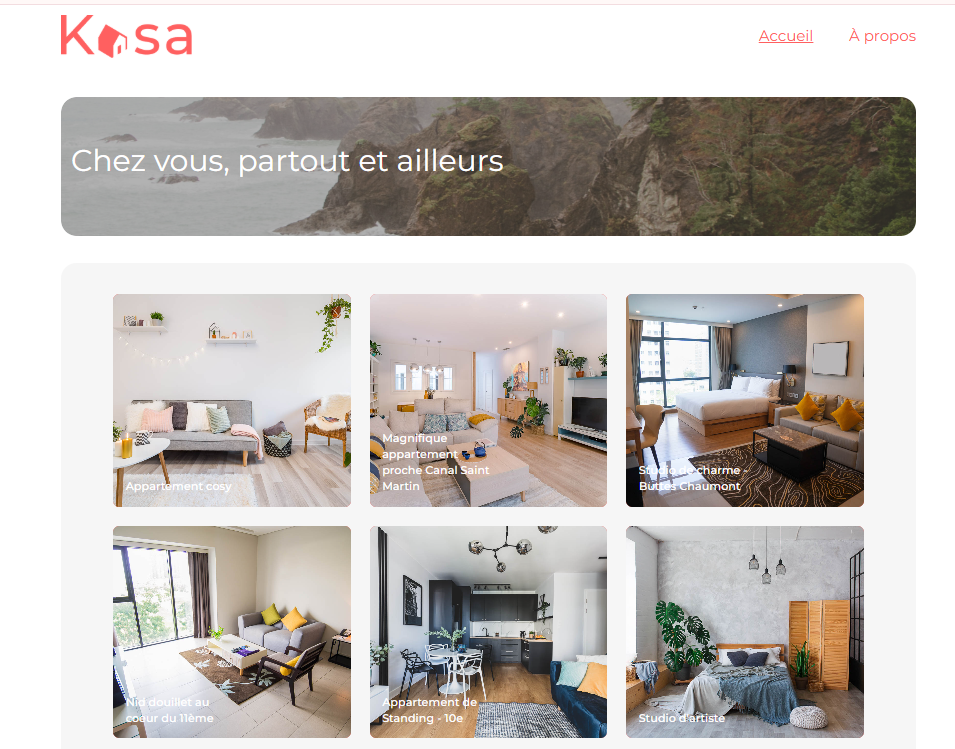

# KASA

### Projet 7 | Parcours "Développeur web" OpenClassrooms | Créez une application web de location immobilière avec React

Le projet a été recodé avec les dernières versions de React (v.19.1.0), React Router (v.7.5.3), l'utilisation de Tailwindcss v.4.1.5 et créé avec vite.js (*npm create vite@latest*) et non pas *create-react-app* (qui est déprécié)

## Mission

Développer la nouvelle plateforme web de la société Kasa, leader dans la location d'appartements entre particuliers en France, dans le cadre d'une refonte totale du site.
Le front-end sera codé en React.

## Spécificités fonctionnelles

* Composant *Gallery* : permet le défilement des photos dans la galerie
    * Si la première image est affichée : au clic sur "Image précédente", affichage de la dernière image
    * Si la dernière image est affichée : au clic sur "Image suivante", affichage de la première image
    * S'il n'y a qu'une seule image : les boutons "Suivant" et "Précédent" n'apparaissent pas
    * Hauteur de la galerie :
        * Celle indiquée sur la maquette
        * Les images sont coupées et centrées dans le cadre de l'image

* Composant *Collapse* : 
    * Par défaut, les *Collapses* sont fermés
    * Si le *Collapse* est ouvert : au clic, il se ferme
    * Si le *Collapse* est fermé : au clic, il s'ouvre

## Spécificités techniques

### Technologies utilisées 

* **Figma** : maquettes (fournies)
* **npm create vite@latest** : création du projet
* **React Router v.7.5.3** : librairie utilisée pour le routing
* **React v.19.1.0**
* **Tailwindcss v.4.1.5** : styling
* **VSCode** : éditeur de code
* **GitHub** : hébergement du projet
* Pas de librairie React externe

### React

* Éléments React à utiliser :
    * Découpage en composants modulaires et réutilisables
    * Un composant par fichier
    * Structure logique des différents fichiers
    * Utilisation des *props* entre les composants
    * Utilisation du *state* dans les composants lorsque c'est nécessaire
    * Gestion des événements
    * Utilisation des *listes* en itérant dessus avec **map**, par exemple
    * Utilisation des composants fonctionnels fortement recommandée

### React Router v7

* La gestion des paramètres des routes est gérée par React Router dans l'URL pour récupérer les informations de chaque logement
* Une page par route
* Une page 404 est renvoyée pour chaque route inexistante, ou si une valeur présente dans l'URL ne fait pas partie des données
* La logique du routeur est réunie dans un seul fichier

Le code ne doit pas produire d'erreur ou de warning dans la console

### Lancement du projet

Dans le dossier du projet, lancer :

`npm run dev`

Pour l'ouvrir dans le navigateur :

* Ouvrir [http://localhost:5173/] (http://localhost:5173/)